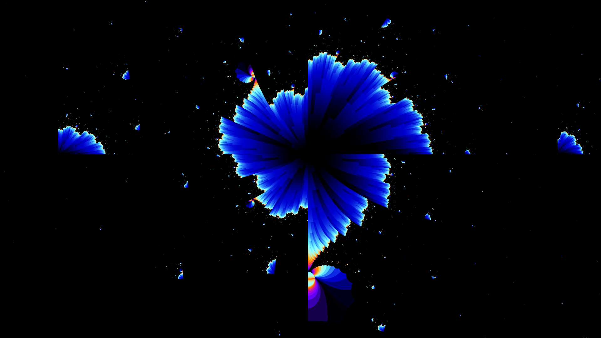
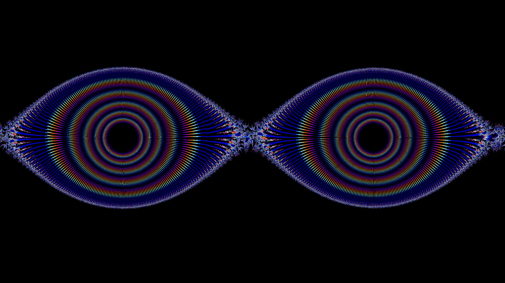
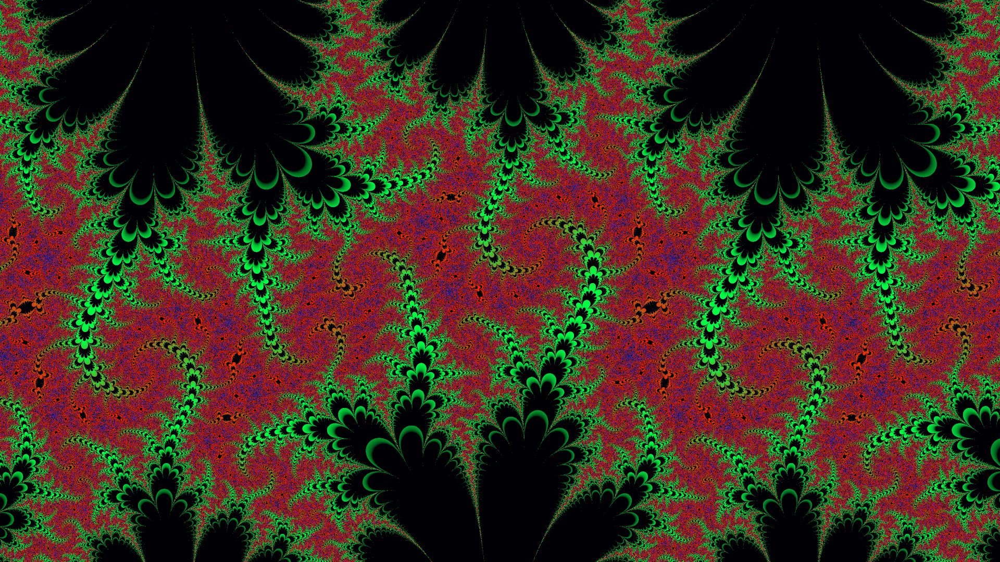
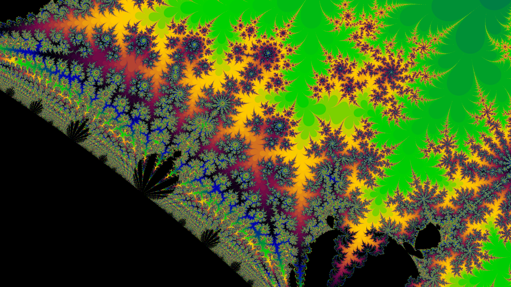
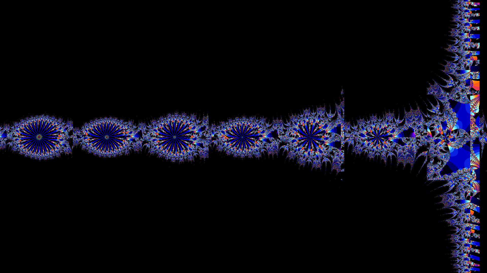
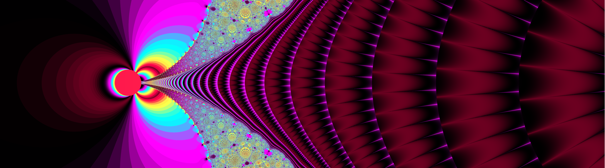

# Borch-Fractal-Archive
This repository is an archive for all of my fractal artwork for everyone to download and access. These fractals have been generated using Ultrafractal, as well as Custom python, C, and other mathematics utilities. I hope you enjoy the art and are able to find something you like :D. Feel free to download them, but commercial use should cite my work.

  
   
  

  
   
  

  
   
  

  
   
  

  
   
  

  
   
  

  

